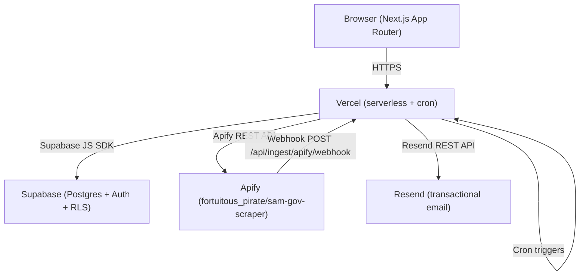
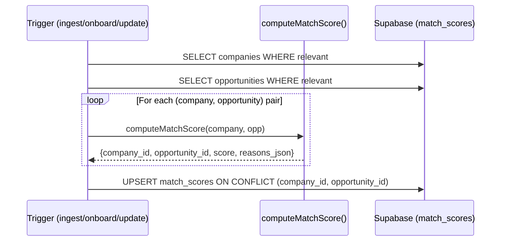
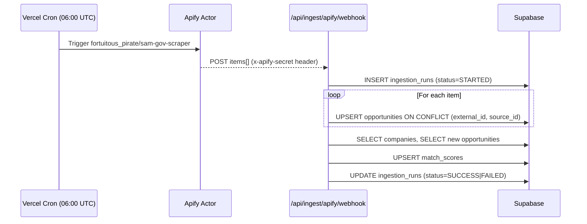
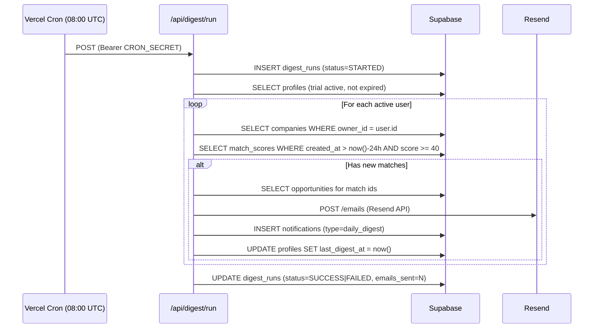

# Design Document: Tendly MVP

## Overview

Tendly is a government contract matching platform for small businesses. The MVP is a Next.js 16 App Router application deployed on Vercel, backed by Supabase (auth, Postgres, RLS) and Apify (SAM.gov scraping). Users sign up, complete a one-time onboarding form, and immediately see a personalized feed of federal contract opportunities scored against their NAICS codes, certifications, and geography. A daily email digest keeps them informed without requiring daily logins. Access is gated to a 24-hour pilot window.

The codebase is already partially built. This design describes the complete system as it should exist at pilot launch, including gaps that need to be filled.

---

## Architecture



**Key architectural decisions:**

- All server-side logic runs as Next.js Route Handlers (serverless functions on Vercel). No separate backend process.
- Supabase RLS enforces data isolation at the database layer — users can only read their own companies and match scores.
- The matching engine (`lib/matching.ts`) is a pure TypeScript function, called inline after ingestion and after onboarding. No separate worker.
- Apify delivers results via webhook to `/api/ingest/apify/webhook`. A fallback poll route exists for manual triggering.
- Vercel cron jobs (defined in `vercel.json`) trigger ingestion and digest on a daily schedule. All cron-triggered routes require a `CRON_SECRET` bearer token.
- Trial enforcement is implemented in Next.js middleware (redirect for page routes) and in the `/api/feed/my` route handler (403 for API routes).

---

## Page and Route Structure

### Pages (App Router)

| Route | Auth Required | Description |
|---|---|---|
| `/` | No | Landing / marketing page |
| `/login` | No | Supabase Auth UI login |
| `/signup` | No | Supabase Auth UI sign-up |
| `/onboard` | Yes (no company) | One-time onboarding form |
| `/dashboard` | Yes + trial active | Personalized match feed |
| `/dashboard/settings` | Yes | Edit company profile |
| `/admin` | Yes + OWNER role | Admin overview |
| `/admin/ingestion` | Yes + OWNER role | Ingestion run history + trigger |
| `/admin/digest` | Yes + OWNER role | Digest run history + trigger |
| `/admin/users` | Yes + OWNER role | User list with trial status |
| `/paywall` | Yes + trial expired | Trial-ended screen with CTA |

### API Routes

| Route | Method | Auth | Description |
|---|---|---|---|
| `/api/onboard/create` | POST | Session | Create company profile, trigger initial match |
| `/api/feed/my` | GET | Session + trial | Return scored matches for current user |
| `/api/ingest/sam/run` | GET | CRON_SECRET | Run SAM.gov ingestion via direct API |
| `/api/ingest/apify/webhook` | POST | APIFY_WEBHOOK_SECRET | Receive Apify actor results |
| `/api/ingest/apify/poll` | POST | CRON_SECRET | Poll Apify for latest run results |
| `/api/digest/run` | POST | CRON_SECRET | Run daily digest for all active users |
| `/api/match/run` | POST | CRON_SECRET or internal | Recompute matches for a company |

### Middleware

`middleware.ts` at the project root handles:
1. Unauthenticated users → redirect to `/login`
2. Authenticated users with no company → redirect to `/onboard`
3. Authenticated users with expired trial → redirect to `/paywall`
4. Non-OWNER users accessing `/admin/*` → redirect to `/dashboard`

The middleware reads the Supabase session cookie and queries `profiles` + `companies` to determine routing. It uses the Supabase SSR client (`@supabase/ssr`) to avoid exposing the service role key.

---

## Components and Interfaces

### Existing Components (to be completed)

**`src/components/OnboardForm.tsx`** — collects company name, NAICS codes (comma-separated), location, certifications, keywords. POSTs to `/api/onboard/create`. Needs client-side validation: company name required, at least one NAICS code required.

**`src/components/DashboardFeed.tsx`** — fetches `/api/feed/my`, renders match cards. Needs: score badge, deadline urgency indicator (red/amber for ≤7 days), SAM.gov link, empty state message, trial countdown banner.

**`src/components/RunIngestionButton.tsx`** — admin button that POSTs to `/api/ingest/sam/run` with CRON_SECRET header.

**`src/components/RunDigestButton.tsx`** — admin button that POSTs to `/api/digest/run` with CRON_SECRET header.

### New Components Needed

**`TrialCountdown`** — displays remaining pilot window time. Reads `trial_started_at` from profile, computes expiry, shows `HH:MM:SS` or `X hours remaining`. Hides when trial is expired.

**`PaywallScreen`** — full-page overlay shown when trial is expired. Contains CTA (email link or waitlist form).

**`ProfileSummary`** — sidebar/header showing company name and active certifications.

**`AdminUserTable`** — table of users with company name, `trial_started_at`, computed `trial_expires_at`, and status badge (Active / Expired).

### Key Interfaces

```typescript
// /api/feed/my response
interface FeedResponse {
  matches: MatchWithOpportunity[]
  trialExpiresAt: string // ISO timestamp
  trialActive: boolean
}

interface MatchWithOpportunity {
  id: string
  score: number
  reasons_json: ScoringReason[]
  opportunity: {
    id: string
    title: string
    agency: string
    naics_code: string | null
    set_aside: string | null
    place_of_performance: string | null
    value_min: number | null
    value_max: number | null
    proposals_due_at: string | null
    sam_or_source_url: string
  }
}

interface ScoringReason {
  reason: string
  contribution: number
}
```

---

## Data Models

The schema is defined in `supabase/migrations/`. Key tables and their roles in the MVP:

### `profiles`
Extends `auth.users`. Needs two additional columns not yet in migration 001:
- `trial_started_at timestamptz` — set on first login
- `last_digest_at timestamptz` — updated after each digest send

```sql
alter table public.profiles
  add column if not exists trial_started_at timestamptz,
  add column if not exists last_digest_at timestamptz;
```

### `companies`
One row per user (owner_id = profiles.id). Key matching fields:
- `naics_codes text[]` — array of NAICS codes
- `socio_economic_certs text[]` — e.g. `['SDVOSB', 'WOSB']`
- `target_geographies text[]` — e.g. `['Texas', 'Virginia']`
- `capability_keywords text[]` — free-text keywords

### `opportunities`
Ingested from SAM.gov / Apify. Conflict key: `(external_id, source_id)`. Active opportunities: `proposals_due_at > now()`.

### `match_scores`
One row per `(company_id, opportunity_id)` pair. Conflict key enforces upsert semantics. Score range: 0–100. `reasons_json` is an array of `{reason, contribution}` objects.

### `ingestion_runs`
Audit log for each ingestion execution. Status lifecycle: `STARTED → SUCCESS | FAILED`.

### `digest_runs`
Audit log for each digest execution. Columns: `started_at`, `finished_at`, `status`, `total_users`, `emails_sent`, `error_json`.

### `notifications`
One row per sent digest per user. `type = 'daily_digest'`. The `notifications.type` check constraint in migration 001 currently only allows `NEW_HIGH_FIT`, `DEADLINE_REMINDER`, `RFP_AMENDMENT` — needs to be updated to include `daily_digest`.

```sql
alter table public.notifications
  drop constraint if exists notifications_type_check;
alter table public.notifications
  add constraint notifications_type_check
  check (type in ('NEW_HIGH_FIT','DEADLINE_REMINDER','RFP_AMENDMENT','daily_digest'));
```

### RLS Summary

| Table | Policy |
|---|---|
| `profiles` | Users read/update own row |
| `companies` | Users read/insert/update own row (owner_id = auth.uid()) |
| `opportunities` | Public read |
| `match_scores` | Read by company owner |
| `notifications` | Read by user (user_id = auth.uid()) |
| `ingestion_runs` | Service role only (no user-facing RLS needed) |
| `digest_runs` | Service role only |

---

## Matching Engine Design

The matching engine is a pure function in `lib/matching.ts`. It is called:
1. After each ingestion run — for all companies × all newly ingested opportunities
2. After onboarding — for the new company × all existing opportunities
3. After a profile update — for the updated company × all existing opportunities

### Scoring Formula

| Dimension | Weight | Full Points | Partial |
|---|---|---|---|
| NAICS match | 40% | 40 pts if company NAICS includes opp NAICS | 0 if no match |
| Set-aside eligibility | 25% | 25 pts if cert matches set-aside | 12 pts if no set-aside restriction |
| Geography | 15% | 15 pts if place_of_performance in target_geographies | 7 pts if place unspecified |
| Contract value band | 10% | 10 pts if value in $100K–$5M range or unspecified | 0 otherwise |
| Capability keywords | 10% | Up to 10 pts, scaled by keyword hits (max 5 hits = 10 pts) | Proportional |

**Score threshold:** Matches with score < 40 are stored but not surfaced in the feed or digest.

### Match Computation Flow



---

## Ingestion Pipeline

### Primary Path: Apify Webhook



### Fallback Path: Direct SAM.gov API

`/api/ingest/sam/run` calls the SAM.gov REST API directly (with retry/backoff). Used when Apify is unavailable or for testing. Protected by `CRON_SECRET`.

### Vercel Cron Schedule

`vercel.json` should define two crons:

```json
{
  "crons": [
    {
      "path": "/api/ingest/sam/run",
      "schedule": "0 6 * * *"
    },
    {
      "path": "/api/digest/run",
      "schedule": "0 8 * * *"
    }
  ]
}
```

Vercel cron jobs call the route with a `Authorization: Bearer <CRON_SECRET>` header automatically when configured via environment variables. The routes validate this header before executing.

> Note: Vercel cron jobs on the Hobby plan run at most once per day. The Pro plan supports more frequent schedules. For the pilot, once-daily is sufficient.

---

## Digest Pipeline



### Digest Email Content

- Subject: `Tendly: X new contract matches for [Company Name]`
- Body (HTML):
  - Count of new matches
  - Up to 10 matches sorted by score descending, each showing: title, agency, score badge, proposals_due_at, deadline warning if ≤7 days, link to SAM.gov listing
  - CTA button linking to `/dashboard`
- Trial-expired users are skipped (checked via `trial_started_at + 24h < now()`)
- Users with zero new matches (score ≥ 40, created in last 24h) are skipped

---

## Trial / Paywall Enforcement

### Trial Start

`trial_started_at` is set on the `profiles` row the first time a user successfully authenticates. This is handled in the middleware or in a post-login server action:

```typescript
// In middleware or auth callback
if (!profile.trial_started_at) {
  await supabase.from('profiles').update({ trial_started_at: new Date().toISOString() }).eq('id', userId)
}
```

### Trial Expiry Computation

```typescript
const trialExpiresAt = new Date(profile.trial_started_at).getTime() + 24 * 60 * 60 * 1000
const trialActive = Date.now() < trialExpiresAt
```

### Enforcement Points

| Layer | Mechanism | Behavior |
|---|---|---|
| Middleware | Check `trial_started_at + 24h` vs `now()` | Redirect expired users to `/paywall` |
| `/api/feed/my` | Same check server-side | Return 403 with `{ error: 'trial_expired' }` |
| Digest runner | Skip users where `trial_started_at + 24h < now()` | No email sent |
| Data | No deletion | Company and match data preserved after expiry |

### Paywall Screen

Shown at `/paywall`. Contains:
- Message: "Your 24-hour pilot has ended."
- CTA: "Contact us to get full access" (mailto link or waitlist form)
- No match data visible

---

## Error Handling

| Scenario | Behavior |
|---|---|
| Apify actor error / timeout | Mark `ingestion_runs` as FAILED, store error in `error_json`, preserve existing opportunities |
| SAM.gov API rate limit / error | Retry up to 3 times with exponential backoff (500ms, 2s, 8s), then mark FAILED |
| Resend delivery error | Log error, skip user, continue digest run, do not retry in same run |
| Onboard API error | Return 500 with error message, do not create partial company record |
| Feed API — unauthenticated | Return 401 |
| Feed API — trial expired | Return 403 with `{ error: 'trial_expired' }` |
| Admin API — missing/invalid CRON_SECRET | Return 401 |
| Match computation error | Log error, mark ingestion run as FAILED, do not surface partial scores |
| Supabase connection error | Propagate as 500, log to Vercel function logs |

---

## Vercel Deployment

### `vercel.json`

```json
{
  "crons": [
    {
      "path": "/api/ingest/sam/run",
      "schedule": "0 6 * * *"
    },
    {
      "path": "/api/digest/run",
      "schedule": "0 8 * * *"
    }
  ]
}
```

### Required Environment Variables

| Variable | Description |
|---|---|
| `NEXT_PUBLIC_SUPABASE_URL` | Supabase project URL |
| `NEXT_PUBLIC_SUPABASE_ANON_KEY` | Supabase anon/public key |
| `SUPABASE_SERVICE_ROLE_KEY` | Supabase service role key (server-only) |
| `CRON_SECRET` | Secret token for cron-triggered routes |
| `APIFY_TOKEN` | Apify API token |
| `APIFY_ACTOR_ID` | Apify actor ID (`fortuitous_pirate/sam-gov-scraper`) |
| `APIFY_WEBHOOK_SECRET` | Secret for validating Apify webhook calls |
| `SAM_GOV_API_KEY` | SAM.gov API key (fallback direct ingestion) |
| `RESEND_API_KEY` | Resend API key for transactional email |
| `RESEND_FROM` | Verified sender address (e.g. `digest@tendly.co`) |
| `NEXT_PUBLIC_BASE_URL` | Full deployment URL (e.g. `https://tendly.vercel.app`) |

### Deployment Notes

- Vercel serverless functions have a default 10s timeout on Hobby, 60s on Pro. The ingestion and digest routes may need the Pro plan or should be broken into smaller chunks for large datasets.
- The Apify webhook URL must be registered in the Apify actor's webhook settings: `https://<your-domain>/api/ingest/apify/webhook`.
- Supabase RLS must be enabled on all user-facing tables (already done in migration 001).
- The `CRON_SECRET` must be set in Vercel environment variables. Vercel automatically passes it as `Authorization: Bearer <CRON_SECRET>` for cron-triggered routes when the variable name matches.

---

## Correctness Properties

*A property is a characteristic or behavior that should hold true across all valid executions of a system — essentially, a formal statement about what the system should do. Properties serve as the bridge between human-readable specifications and machine-verifiable correctness guarantees.*

### Property 1: Protected routes redirect unauthenticated users

*For any* HTTP request to a protected route (`/dashboard`, `/onboard`, `/admin/*`) made without a valid Supabase session, the middleware SHALL respond with a redirect to `/login`.

**Validates: Requirements 1.8**

### Property 2: Onboarding validation rejects incomplete submissions

*For any* POST to `/api/onboard/create` that is missing a company name or has an empty NAICS codes array, the endpoint SHALL return an error response and SHALL NOT create a company record in the database.

**Validates: Requirements 2.4**

### Property 3: Ingestion upsert is idempotent

*For any* batch of opportunity records, running the ingestion upsert twice SHALL produce the same set of rows in the `opportunities` table as running it once — no duplicates, no data loss.

**Validates: Requirements 3.2, 4.9**

### Property 4: Ingestion run always reaches a terminal status

*For any* ingestion run (whether it succeeds or fails), the corresponding `ingestion_runs` record SHALL end with status `SUCCESS` or `FAILED` — never left as `STARTED`.

**Validates: Requirements 3.4**

### Property 5: Failed ingestion preserves existing opportunities

*For any* ingestion run that encounters an error, the count of rows in the `opportunities` table after the run SHALL be greater than or equal to the count before the run started.

**Validates: Requirements 3.5**

### Property 6: Opportunity field mapping is complete

*For any* valid item returned by the Apify actor or SAM.gov API, the mapped `opportunities` record SHALL contain non-null values for `title`, `agency`, `synopsis`, and `sam_or_source_url`, and SHALL correctly map `naics_code`, `set_aside`, `place_of_performance`, `posted_at`, and `proposals_due_at` from the source payload.

**Validates: Requirements 3.6**

### Property 7: Expired opportunities are excluded from the feed

*For any* opportunity whose `proposals_due_at` is before the current time, it SHALL NOT appear in the results returned by `/api/feed/my`.

**Validates: Requirements 3.7, 5.5**

### Property 8: Match score formula is correct and bounded

*For any* company and opportunity pair, `computeMatchScore` SHALL return a score between 0 and 100 (inclusive) equal to the sum of applicable weight contributions: NAICS (40 pts), set-aside (25 pts full / 12 pts partial), geography (15 pts full / 7 pts partial), value band (10 pts), keywords (up to 10 pts scaled by hit count).

**Validates: Requirements 4.2, 4.3, 4.4, 4.5, 4.6**

### Property 9: Match computation covers all company–opportunity pairs

*For any* ingestion run that produces N new opportunities and M companies in the database, the `match_scores` table SHALL contain at least N × M upserted records after the run completes.

**Validates: Requirements 4.1**

### Property 10: Feed only returns matches above the score threshold

*For any* response from `/api/feed/my`, all returned match records SHALL have a score greater than or equal to 40.

**Validates: Requirements 4.7**

### Property 11: Feed only returns the authenticated user's matches

*For any* authenticated user, all match records returned by `/api/feed/my` SHALL have a `company_id` that belongs to a company owned by that user.

**Validates: Requirements 5.1**

### Property 12: Feed results are sorted by score descending

*For any* response from `/api/feed/my` containing two or more matches, the scores SHALL appear in non-increasing order.

**Validates: Requirements 5.2**

### Property 13: Trial expiry is exactly 24 hours after trial start

*For any* `trial_started_at` timestamp, the computed `trial_expires_at` SHALL equal `trial_started_at + 86400000` milliseconds.

**Validates: Requirements 6.2**

### Property 14: Expired trial blocks feed access with 403

*For any* user whose `trial_started_at + 24h` is before the current time, a GET request to `/api/feed/my` SHALL return HTTP 403 with `{ error: 'trial_expired' }`.

**Validates: Requirements 6.6**

### Property 15: Trial expiry does not delete user data

*For any* user whose trial has expired, their `companies` and `match_scores` records SHALL still exist in the database.

**Validates: Requirements 6.7**

### Property 16: Digest is sent only to users with new matches

*For any* user with zero `match_scores` records created in the last 24 hours (or with score < 40), `runDigestForAll` SHALL NOT invoke `sendEmail` for that user.

**Validates: Requirements 7.1, 7.5**

### Property 17: Digest email content is complete and correctly ordered

*For any* user with N new matches (N ≥ 1), the generated digest HTML SHALL contain the match count, up to 10 matches sorted by score descending, and for each match: title, agency, score, `proposals_due_at`, a deadline warning if due within 7 days, and a link to the SAM.gov listing.

**Validates: Requirements 7.2, 7.3, 7.4**

### Property 18: Digest delivery is recorded in notifications

*For any* user who is sent a digest email, a row SHALL be inserted into `notifications` with `type = 'daily_digest'` and a non-null `sent_at` timestamp.

**Validates: Requirements 7.6**

### Property 19: Expired trial users are skipped in digest

*For any* user whose `trial_started_at + 24h` is before the current time, `runDigestForAll` SHALL NOT invoke `sendEmail` for that user.

**Validates: Requirements 7.7**

### Property 20: Admin trigger endpoints require valid CRON_SECRET

*For any* POST/GET request to `/api/ingest/sam/run` or `/api/digest/run` that does not include a valid `Authorization: Bearer <CRON_SECRET>` header, the endpoint SHALL return HTTP 401.

**Validates: Requirements 8.7**

---

## Testing Strategy

### Property-Based Testing

The matching engine and pipeline logic are well-suited to property-based testing because they are pure or near-pure functions with large input spaces. Use **fast-check** (TypeScript-native PBT library).

Each property test runs a minimum of 100 iterations. Tests are tagged with the property they validate.

```typescript
// Example: Property 8 — score formula correctness
import fc from 'fast-check'
import { computeMatchScore } from '../lib/matching'

test('Property 8: match score is bounded 0-100 and reflects weights', () => {
  // Feature: tendly-mvp, Property 8: match score formula is correct and bounded
  fc.assert(fc.property(
    fc.record({ id: fc.uuid(), naics_codes: fc.array(fc.string()), ... }),
    fc.record({ id: fc.uuid(), naics_code: fc.option(fc.string()), ... }),
    (company, opp) => {
      const result = computeMatchScore(company, opp)
      return result.score >= 0 && result.score <= 100
    }
  ), { numRuns: 100 })
})
```

Properties covered by PBT: 2, 3, 4, 5, 6, 7, 8, 9, 10, 11, 12, 13, 14, 15, 16, 17, 18, 19, 20.

### Unit Tests (Example-Based)

Focus on specific scenarios not covered by property tests:

- Auth redirect flows (login success → `/dashboard`, login failure → error message)
- Onboarding happy path (valid submission → company created → redirect)
- Empty dashboard state (no matches → empty state message shown)
- Trial countdown display (active trial → countdown visible)
- Paywall display (expired trial → paywall shown, no matches visible)
- Admin panel access (non-OWNER → redirected)
- Digest error handling (Resend throws → error logged, run continues)

### Integration Tests

- End-to-end onboarding: sign up → onboard → dashboard shows matches
- Ingestion run: trigger `/api/ingest/sam/run` with mock SAM data → opportunities upserted → match scores computed
- Digest run: trigger `/api/digest/run` → email sent to users with new matches → notifications recorded

### Test Configuration

- PBT library: `fast-check`
- Test runner: Vitest (`vitest --run` for CI)
- Mocking: Vitest's `vi.mock` for Supabase client and Resend API calls
- Each property test: minimum 100 iterations (`numRuns: 100`)
- Tag format: `// Feature: tendly-mvp, Property N: <property title>`
